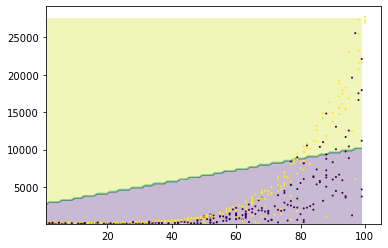
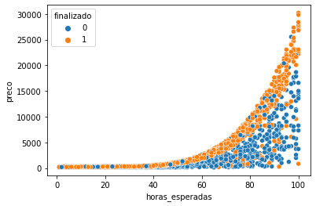
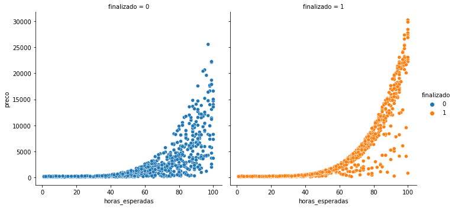

# Estudos-de-Casos
Estudo de casos diversos durante o processo de aprendizado de ferramentas de Machine Learning

________________________________________________________

# 1 - Acessos e Vendas

### O Código está no arquivo `acessos_e_vendas.py`

Este é um estudo de caso utilizando o método LinearSVC do SkLearn.
Os dados são separados em dados de treino e teste de duas maneiras:

* Separação manual
* Utilizando o método train_test_split do sklearn

## Resultados

O algoritmo consegue prever com uma média de 96% se um usuário vai comprar um produto baseado nas páginas acessadas por ele no site.

A boa precisão do aprendizado se dá, na maior parte, devido à simplicidade dos dados de treinamento que só possuem 3 colunas.
Para modelos mais elaborados, com muitos dados de entrada, será necessário utilizar novos modelos de aprendizagem.

_________________________________________________________
### - Estudando um pouco sobre o método LinearSVC...

 Como o nome sugere, o método LinearSVC define uma linha reta de separação entre os dados chamada de **Curva de Decisão** . Esta curva separa as classes de dados em duas e funciona bem para casos mais simples, onde podemos facilmente observar a linha de separação. A figura a seguir, mostra a curva de decisão tomada para alguns tipos de dados do exemplo seguinte, de Projetos de Sites.

 Podemos perceber que para este tipo de base de dados o método LinearSVC não é muito eficaz, necessitando desenvolver algoritmos que possuem uma Curva de Decisão que se adeque melhor aos dados utilizados.
__________________________________________________________

# 2 - Projetos de Sites

### O Código está no arquivo `projetos_de_sites.py`

Este é um estudo de caso de dados de projetos de sites e sua conclusão baseada no preço a ser pago pelas quantidades de horas de dedicação.

Inicialmente, realizamos o tratamento da base dos dados. Mudamos os nomes das colunas, realizamos mapeamento para mudar a coluna de não-finalizados para finalizados (para garantir que 0 é False e 1 é True).

Após o tratamento, realizamos o plot para visualização dos dados de duas formas:
* Usando o scatterplot:

* Usando o relplot:

Em seguida, escrevemos o modelo para realizar o treinamento e previsão. Usamos o método LinearSVC para fit dos dados.

Neste caso, obtivemos uma margem de acerto de ***55.37%***.

Definimos a baseline com o comando `baseline = np.ones()` e obtivemos uma precisão de ***52.59%***.

Isso significa que nossa previsão ainda está longe de ser boa.

> Em breve darei continuidade a métodos de melhoria desse algoritmo.

